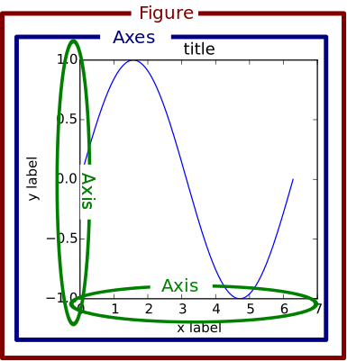

# Python常用库

## requests

http库

## scrapy

爬虫库

## SQLAIchemy

数据库的库

## twisted

网络应用开发

## numpy

科学计算基础包

对数组的一系列操作构成了numpy的核心功能，具体包括一下功能

* 数值运算：对加减乘除等的简单运算直接用运算符实现，其他的要调用函数如np.sin(), np.log()
* 条件运算：不能直接对数组使用条件运算符，而是应该用np.where(condition, x, y)
* 重塑操作：为数组设定新的维度，并将数组重塑，需要保证重塑的前后数的个数不变，重塑还有顺序的问题需要考虑，按不同顺序的重塑结果可能不一样
* 求和运算：调用np.sum()函数，还可以指定求和的轴以及求和后数组的维度是否改变

针对矩阵这一特殊的数组还提供了以下运算

* 点乘：调用matmul()
* 转置：调用transpose()
* 求秩：调用np.rank()
* 求逆：调用np.linalg.inv()
* 求伪逆：调用np.linalg.pinv()
* 求线性方程：调用np.linalg.solve()
* 求特征值：调用np.linalg.eigvals()
* 求特征值和特征向量：调用np.linalg.eig()

注意区别：dot(), matmul()/@, multiply()/*的各自特点和区别

## scipy

算法和数学工具库

## matplotlib

绘图库

面向状态的绘图：pyplot维护一个当前绘图对象的状态，通过改变状态来设置显示的具体内容，并最终调用show()方法来实现显示。状态可以包括多个figure、多个axies、以及一些注释性标签，在调用show()方法后同时显示。

面向对象的绘图：使用面向对象的机制，把每个figure以及figure下的axies看成一个个对象，通过改变对象的属性来显示具体的图像，另外不能使用show()方法来最后显示，只能用savefig()来保存。

* fig = plt.figure(arg)：创建figure
* axes = plt.subplot(arg)：创建axies，参数形如221，表示2行2列取第一个
* fig, axes = plt.subplots(arg)：创建axies数组，参数指定行数和列数
* plt.axis(arg)：设定坐标轴尺度
* plt.xlabel(arg)/.ylabel(arg)/.title(arg)/.text(arg)/.grid(arg)/.annotate(arg)
* plt.xscale(arg)/.yscale(arg)：设定x、y轴的标尺参数如'log'
* plt.plot(arg)/.scatter(arg)/.plot_surface(arg)/.imshow()：绘图、散点图、绘面
* plt.show()：显示一个或多个figure
* plt.savefig(arg)：保存图，参数形如'figure.jpg'
* axes = fig.add_subplot(arg)：向fig添加axes，参数形如221，表示2行2列取第一个
* axes.set_xlimt(arg)/.set_ylim(arg)：
* axes.set_xlabel(arg)/.set_ylabel(arg)：
* axes.plot()/.scatter(arg)/plot_surface(arg)/.imshow()：子图绘图、散点图、绘面

更多高级用法

* axes = plt/axes.twinx()/.twiny()：两个axes分别对x轴、y轴复用
* plt/axes.axis('off')：取消显示坐标轴

若要绘制三维图需要导入mpl_toolkits.mplot3d.Axes3D，从而在创建axes的时候指定projection='3d'参数

## Pillow

Python图像库，PIL的一个分支

## scikit-image

图像处理

## scikit-learn

算法学习

## pandas

数据分析工具

## sympy

代数处理、多项式求解、极限、微分、积分、解方程、组合学、离散数学、矩阵运算、几何学、物理学、统计学、密码学

## scapy

用python写的数据包探测和分析工具

## pygame

2D游戏开发工具

## pyglet

3D动画和游戏开发引擎

## wxPython

图形用户界面工具

## pygtk

python的图形界面库

## pyqt

python的图形界面工具

## pywin32

提供和windows交互的方法和类的python库

## tensorflow

机器学习

## pytorch

机器学习

## nltk

自然语言工具包

## nose

python的测试框架

## ipython

可以替代python默认的shell，用于debug时查看对象信息，历史信息等

## pylint, flake8, pylama

源码检查工具
